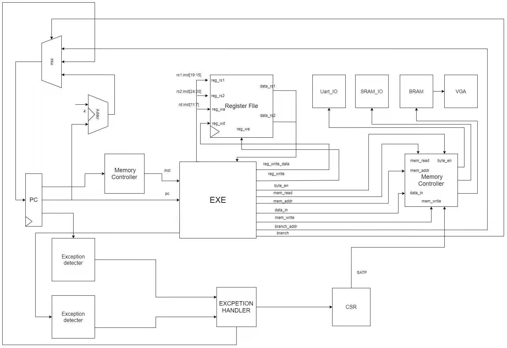
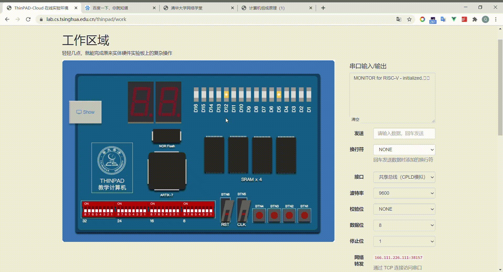

Thinpad RISC-V CPU
---------------

2020年秋季学期，计算机组成原理大作业，基于RISC-V指令集的多周期CPU。

[支持](./doc/plan.md)功能：

- 19 条基本指令和 3 条附加指令
- 异常、中断
- MMU
- ....

## Game Demo

汇编语言编写的迷宫游戏，运行于硬件语言实现的CPU上

## Developers

[乐阳](https://github.com/yueyang2000)

[黄翘楚](https://github.com/huangqc2000)

[张鹤潇](https://github.com/zhanghx0905)

#### 附

代码中包含中文注释，编码为utf-8，在Windows版Vivado下可能出现乱码问题。  
请用别的代码编辑器打开文件，并将编码改为GBK。
