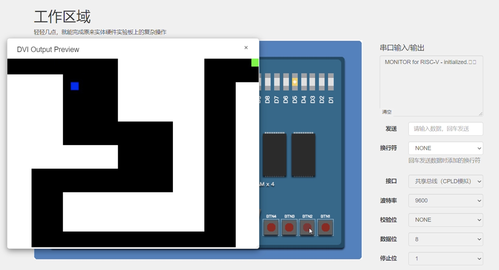

# RISC-V指令集处理器

乐阳		黄翘楚		张鹤潇

## 实验目标概述

本次实验中，我们完成了一个支持**中断异常**和**页表**的多周期CPU，还完成了一些附加的演示功能。工程的全部内容如下：

- RISC-V多周期CPU，时钟频率为50M。
- 实现了19条基础指令和3条扩展指令，（为了编程方便）又多实现了几条RISC-32I的指令。
- 实现了`csrrc, csrrs, csrrw, ebreak, ecall, mret`等与异常相关的语句和`mtvec, mtval, mepc, mcause, mstatus`几个专用寄存器。
- 实现了监控程序可能发生的12种异常，包括三种页缺失异常。异常号为`0,1,2,3,4,5,6,7,8,12,13,15`。
- 实现了用户态地址映射和`satp`寄存器。可以稳定运行完整版的监控程序。
- 实现了VGA显示驱动功能，用BRAM作为VGA渲染的缓冲区，并将BRAM的地址映射到监控程序地址空间的一部分。
- 用汇编语言编写了一个走迷宫小游戏，代码达两百余行。用户可以按动实验板上的按钮`btn0~btn4`（上下左右）操纵画面中的物块移动，走向迷宫的终点。软件程序负责计算渲染画面，通过地址映射写入缓冲区BRAM中。

## 主要模块设计与实现

### 硬件部分

各主要模块说明如下

```
thinpad_top.v: 顶层模块，含多周期CPU的状态机
defines.vh: 定义了本次实验要用到的一些常量
regfile.v: 通用寄存器组模块
mem_controller.v: 访存控制模块，综合SRAM、串口、VGA、按钮的访问，同时包含页表的查看与虚实地址转换。
data_loader.v: 
uart_io.v: 多周期读写串口驱动模块
sram_io.v: 多周期读写SRAM驱动模块
addr_check.v: 检查地址是否合法
addr_decode.v: 判断访存的地址来自哪一个外设（SRAM、串口、VGA、按钮）
exe.v: 集译码和执行于一体，从指令机器码生成各种控制信号
vga.v: VGA控制模块，从BRAM中读取显示的数据
exp_if.v: 取指阶段的异常检测模块
exp_exe.v: 译码执行阶段的异常检测模块
exp_handle.v: 异常处理模块，负责处理各种同步异常，以及执行与异常相关的指令，也负责管理CSR寄存器组
```

数据通路图大致为：


#### CPU状态机

多周期CPU状态机实现在顶层模块`thinpad_top`中，可以大致分为如下几个状态：

1. 取指状态：如果pc地址合法则执行取指，转移至译码执行状态；否则监测到取指异常，进入异常处理状态。
2. 译码执行状态：将取得的指令送入`exe`模块，产生访存、写回、跳转的控制信号。在该阶段监测其余所有异常，发生异常则转异常处理状态（遇到异常相关的语句也进入异常处理状态），否则进入访存状态。
3. 访存状态：根据译码执行状态产生的控制信号进行访存操作，访存完毕后转写回状态。（不需要访存则直接转写回）
4. 写回状态：根据译码执行阶段产生的写回控制信号执行寄存器组的写回操作。更新pc，转取指状态，当前语句执行完毕。
5. 异常处理状态：进入本状态由两种可能，运行中的代码抛出了异常，或当前语句为csr寄存器操作或`ebreak, ecall, mret`之一。本状态中会处理以上两种情况，维护CSR寄存器，在发生异常跳转时更新pc。

#### 译码执行模块

译码执行实现在`exe`模块中，寄存器组模块为`regfile`。

本组实现的CPU将译码和执行集成到一个模块、在一个周期内执行完。我们这样设计是基于如下考量：

- RISC-V指令集中源寄存器、目的寄存器、op_code等字段的位置是固定的，译码开销很小。
- 译码结果与执行的行为直接相关，额外添加ALU模块和有关控制信号十分冗余。
- 从机器码直接生成访存、写回控制信号，代码实现更加简洁。

将译码执行合二为一的一个问题是在该周期内时序存在风险，我们的解决办法是译码和执行是**并行**完成的。由于机器码中各域的位置固定，因此可以在译码之前将所有可能的指令结果计算出来。例如下面的代码给出了部分指令的执行结果。

```verilog
wire[`DataBus] add_result = reg1_data_i + reg2_data_i;
wire[`DataBus] ori_result = reg1_data_i | immI;
wire[`DataBus] srl_result = reg1_data_i >> reg2_data_i[4:0];
wire[`DataBus] slli_result = reg1_data_i << shamt;
wire[`DataBus] b_addr = pc + immB;
wire[`DataBus] jal_addr = pc + immJ;
wire[`DataBus] jalr_addr= reg1_data_i + immI;
```

我们的程序可以在50M时钟下稳定运行，说明我们的优化还是有效果的。

而译码则相当于一个选择器，选用适当的执行结果来生成访存、写回控制信号。在译码时，按照`opcode`、`funct3`和`funct7`执行**完全匹配**，严格检测译码错误。

译码执行模块生成的控制信号规范如下：

```verilog
output reg instValid, // 译码是否正确
output reg branch, // 是否要分支跳转
output reg[`InstAddrBus] branch_addr, // （如果需要）跳转到的地址

output reg mem_rd, //是否要读内存
output reg mem_wr, // 是否要写内存
output reg[`DataBus] mem_wr_data, // 写内存的数据
output reg[`DataAddrBus] mem_addr, // 读写内存的地址
output reg[3:0] ram_be_n, // 字节使能

output reg wb, // 是否要写回寄存器
output wire[`RegAddrBus] wb_reg_addr, // 写回寄存器的地址
output reg[`DataBus] wb_data, // 写回寄存器的数据
```

这些信号负责驱动后续的访存、写回阶段。

#### 访存控制模块

访存控制模块`mem_controller`集成了SRAM、串口、VGA、按钮的读写。CPU访存时只与该模块交互，而不需要知道地址具体对应哪种外设。当CPU需要读内存时，拉低读使能`oen`，等待一些周期后即可从`data_out`信号中读取数据；CPU需要写内存时，拉低写使能`wen`，等待写操作完毕后继续执行。

在`mem_controller`内部，有一些访存的辅助模块，包括

- sram_io：SRAM控制信号的驱动模块，对于base_ram和ext_ram各有一个实例。

- uart_io：CPLD串口控制信号驱动模块

- addr_decode：分辨访存地址属于哪一个外设。产生信号`mem_use`，可能的取值如下：

  ```verilog
  `define USE_VGA 2'b00
  `define USE_BASE 2'b01 
  `define USE_EXT 2'b10 
  `define USE_UART 2'b11 
  ```

- data_loader：生成读操作需要返回的数据，需要处理`lb`和`lw`的区别以及来自不同外设的输出。

读写UART只有两个合法的地址，`UART_DATA_ADDR`和`UART_STATUS_ADDR`，访问前者进入uart读写逻辑，访问后者则返回`uart_dataready`。

#### 异常检测与异常处理

在取指令和译码执行两个阶段检测异常的发生，两个异常检测模块为`exp_if`和`exp_exe`。前者检查的主要是取指令时地址未对齐或非法或页缺失。后者可能发生读取、存储相关的地址未对齐或非法或页缺失，此外还有译码错误。监测到异常后，生成两个控制信号`exception`和`exp_code`，前者表明是否发生异常，后者代表该异常的号码。

为了实现方便，对于CSR寄存器操作和`ebreak, ecall, mret`指令也会交给异常处理模块`exp_handle`来处理。

`exp_handle`模块会根据控制信号`exception`和`exp_code`生成异常相关的控制信号，同时更新CSR寄存器。控制信号主要有：

```verilog
output reg ebranch, // 是否有异常跳转
output reg[`InstAddrBus] ebranch_addr, // 异常跳转地址

output reg wb_reg, // 是否写回通用寄存器
output wire[`RegAddrBus] wb_reg_addr, // 写回寄存器地址
output reg[`DataBus] wb_reg_data, // 写回寄存器数据
```

专用寄存器实现了`mtvec, mtval, mepc, mcause, mstatus`。

#### 虚拟地址映射

完整版的监控程序支持在程序处于用户模式时，启用虚拟地址映射，我们使用全局共享的控制信号`sv32_en`来控制是否启用映射。在启用映射时，每次`mem_controller`访存操作前都需要先获得物理地址。

为了实现方便，`satp`和其他专用寄存器一样都存放在`exp_handle`模块中。`mem_controller`在访存时需要查看`satp`的值来访问页表，具体流程为

1. 收到一个访存请求，若`sv32_en`为1则计算偏移量查看一级页表；否则直接设置物理地址为访存地址，直接进入正常读写流程。
2. 获得一级页表项，查看其读、写、执行三位是否都是0，若是则再查二级页表；否则用实页号和偏移量拼成物理地址，进入正常读写流程。
3. 获得二级页表项，用实页号和偏移量拼成物理地址，进入正常读写流程。

#### VGA显示

创建了一个深度为2^19的双口RAM用于VGA的渲染缓冲区，并将这段存储空间映射到了从`0x20`开头的监控程序地址中。这段地址空间只可以写不能读，读RAM的接口留给VGA的驱动模块。

### 软件部分

我们使用汇编语言编写了一个迷宫小游戏，代码在文件`main.s`中。

#### 显示逻辑

将VGA输出划分成32*24个小格，以小格为单位进行显示。编写`renderSquare`模块，可以将某一小块渲染成某种染色。

#### 控制逻辑

将实验板上四个按钮映射到一个地址，汇编程序只需要`lb`就能获得当前按钮的状态。

#### 游戏流程

首先渲染背景以及终点，游戏地图储存在汇编程序的`BACKGROUND`中，可以进行修改。使用两个寄存器`a5, a6`记录人物的当前位置（初始化为0,0），进入`renderPerson`模块渲染人物。之后进入忙等待阶段，直到有按钮被按下。当有按钮被按下后根据不同的按钮改变当前任务的位置，根据人物新位置重绘当前人物，并通过记数等待一段时间（模拟游戏帧效果），然后重新进入忙等待阶段等待下一个操作。如果当前人物到了终点则通过ecall在终端输出SUCCESS并退出程序。

## 汇编小游戏

详情见小游戏演示视频。

## 实验心得体会

由于有lab3 4 5的铺垫，本次大实验完成的还是十分顺利的。

选择多周期CPU直接将工作量减少到1/3甚至更少，也比较容易调试。基础功能我们只花了两个晚上就调通了，而且几乎没有参考别的代码。异常处理的工作量大致与基础功能相当。在不考虑性能的情况下，页表的实现相对容易，只需要在原有的访存逻辑上略作修改。编写汇编游戏程序反而成为了一个挺难完成的工作，直观感受上甚至”比造机本身更困难“。

本着”不内卷“的精神，我们没有再继续推进其他的拓展功能，换取了三个星期充足的睡眠，我想这也不错。

## 小组分工

乐阳：整体架构设计与接线，CPU状态机模块，访存模块

黄翘楚：译码执行模块，调试框架设计，异常处理模块，汇编小游戏

张鹤潇：译码执行模块，代码调试

